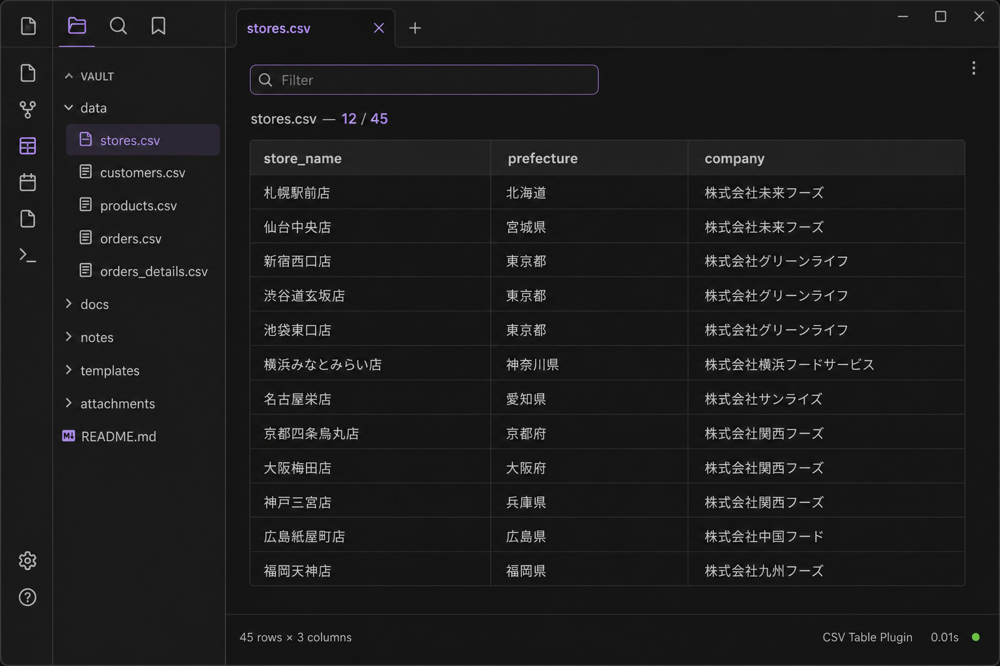

# TableCSV

**[English](#readme-en)** · **[日本語](#readme-ja)**

---

## English

Open `.csv` files as tables inside your vault. View and filter, or edit cells, rows, and columns.

### Features

- Open any CSV file as a clean table view
- Sticky header row for easier scrolling
- **View** mode: text filter to narrow rows (does not change the file)
- **View** mode: click a column header to sort (asc → desc → clear; does not change the file)
- **View** mode: optional **Pin last row** for CSVs with a totals row at the bottom (keeps that row out of sort)
- **Edit** mode: change cells, insert/delete rows and columns, then save to the vault
- **Copy** uses the OS clipboard (tab-separated). Paste into Excel, Notepad, or TextEdit
- **Paste** (Edit mode) reads a table from the clipboard — from Excel or a text editor — and writes it as CSV
- Empty rows and columns stay as you left them
- Works fully offline (no network requests)

### How to use

1. Install **TableCSV** from Community plugins and enable it
2. Open a `.csv` file from the file explorer
3. **View** is the default. Type in the filter box to narrow matching rows. Click a column header to sort. Check **Pin last row** when the bottom row is a total you do not want moved
4. Switch to **Edit** to change the file. The filter and sort are cleared so you edit the whole table
5. Insert or delete the selected row/column with the toolbar. Click a cell to select it. Enter confirms a cell (does not move)
6. **Copy** puts the table on the system clipboard. In View mode this is the header plus filtered rows; in Edit mode it is the whole table
7. In **Edit**, **Paste** replaces the table with clipboard data (tab-separated from Excel, or comma-separated). `Ctrl+V` / `Cmd+V` does the same when focus is not inside a cell

### Tips

- Very large CSV files may take longer to render
- View mode never writes. Edit mode saves to the same `.csv` file in the vault
- Copy uses the system clipboard. It does not require a companion spreadsheet plugin

### Changelog

See [CHANGELOG.md](./CHANGELOG.md). Latest: **1.4.3** — keep original line endings when saving; Edit with no cell changes does not rewrite the file.

### Author

K-Tech Studio

### Support

[Buy Me a Coffee](https://buymeacoffee.com/k_tech_studio)

### Disclaimer (no warranty)

This software is provided **as is**, without warranty of any kind. The developer does not guarantee that it will work in every environment. Use at your own risk. See the [MIT License](LICENSE).

### License

MIT

---

<strong>日本語</strong>（クリックで開閉）

Vault内の `.csv` を表として開きます。閲覧と絞り込み、セル・行・列の編集ができます。

### 機能

- CSVファイルを表形式で表示
- 見出し行を固定してスクロールしやすい
- **View（閲覧）**: 文字で行を絞り込む（ファイルは変更しない）
- **View（閲覧）**: 列見出しをクリックして並べ替え（昇順 → 降順 → 解除。ファイルは変更しない）
- **View（閲覧）**: **最下行を固定** — 合計行など最後の1行を並べ替え対象外にできる
- **Edit（編集）**: セルの変更、行・列の追加・削除。Vault内の同じCSVに保存する
- **Copy（コピー）**: OSのクリップボードへ（タブ区切り）。Excel、メモ帳、TextEditに貼り付けできる
- **Paste（貼り付け）**（編集モード）: Excelやテキストエディタからコピーした表を読み、CSVとして保存する
- 空の行・列はそのまま残る
- 完全オフライン（通信しない）

### 使い方

1. コミュニティプラグインから **TableCSV** を入れて有効にする
2. ファイル一覧から `.csv` を開く
3. 最初は **View**。フィルター欄に文字を入れると行が絞り込まれる。列見出しをクリックすると並べ替え。**最下行を固定** にチェックすると、合計行など最後の1行は並べ替えされず下に残る
4. ファイルを直すときは **Edit** に切り替える。フィルターとソートは解除され、表全体を編集する
5. ツールバーで選択中の行・列を追加・削除する。セルをクリックして選ぶ。Enterは確定のみ（移動しない）
6. **Copy** で表をクリップボードへ送る。Viewでは見出し＋絞り込み後の行、Editでは表全体
7. **Edit** で **Paste** すると、クリップボードの表で置き換わる（Excelからのタブ区切り、またはカンマ区切り）。セルにフォーカスしていないときは `Ctrl+V` / `Cmd+V` でも同じ

### ヒント

- とても大きいCSVは表示に時間がかかることがある
- Viewは書き込まない。EditはVault内の同じ `.csv` に保存する
- コピーはOSのクリップボードを使う。別の表計算プラグインは不要

### 更新履歴

[CHANGELOG.md](./CHANGELOG.md) を参照。最新は **1.4.3** — 保存時に元の改行を維持。セルを変えずに Edit を出てもファイルを書き直さない。

### 作者

K-Tech Studio

### サポート

[Buy Me a Coffee](https://buymeacoffee.com/k_tech_studio)

### 免責（無保証）

本ソフトウェアは **現状有姿（無保証）** で提供します。あらゆる環境での動作を保証しません。利用は自己責任です。詳細は [MIT ライセンス](LICENSE) を参照してください。

### ライセンス

MIT

